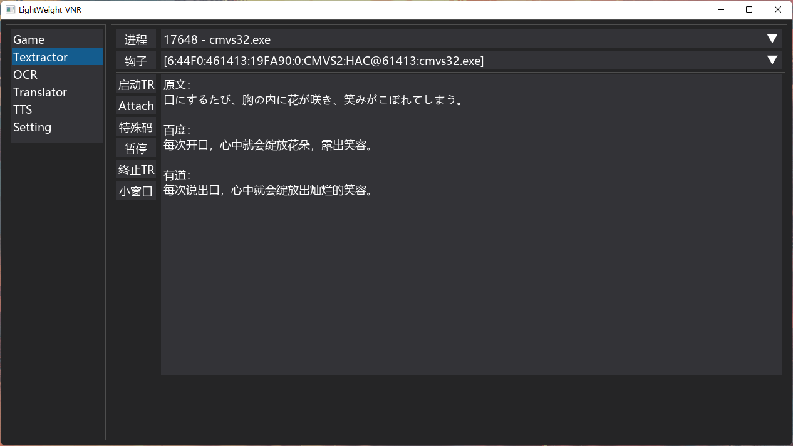

# LightWeight_VNR

---

## 截图

---

## 说明

- 本项目可调用`Textractor`来抓取`Galgame`的游戏文本
- 本项目可调用`Tesseract-OCR`来抓取文字，支持`日文`、`简体中文`、`繁体中文`、`英文`
- 本项目可调用`有道词典（本地）`、`百度翻译`来实现翻译功能
- 本项目可调用`Yukari`、`Tamiyasu`、`VOICEROID2`、`VOICEVOX`等来实现文本阅读功能
- 本项目可满足离线使用的需求

---

## 使用方法

### Game

1. 填好`游戏名称`（可不填）、`程序目录`、`启动方式`、`特殊码`（没有可不填）后`添加/修改`
    - `程序目录`、`启动方式`必须填
    - `游戏名称`若为空，添加时将`程序名`作为`游戏名称`
    - 转区运行需在`设置`中设置`Locale Emulator路径`
2. 选择一项游戏后点击`启动游戏`即可启动游戏，并自动启动`Textractor`并注入`dll`
- 修改游戏信息后点击`添加/修改`即可修改信息
- 选择一项游戏后点击`删除`即可删除

### Textractor

1. 设置`Textractor目录`，确保目录下有`TextractorCLI.exe`和`texthook.dll`
2. 点击`启动TR`，选择`游戏进程`，再点击`Attach`注入`dll`
    - 若从`游戏列表`中启动游戏，则无需进行步骤2
    - `dll`注入后，游戏进程不关，则再次打开程序无需上述步骤
    - `特殊码`使用之前必须确保`dll`已注入，且`特殊码`格式必须正确
3. 选择包含游戏文本的`钩子`

### OCR

1. 从 [Tesseract at UB Mannheim](https://github.com/UB-Mannheim/tesseract/wiki) 下载安装包
    - 可安装或用 `7-zip` 提取到指定文件夹
2. 从 [tessdata](https://github.com/tesseract-ocr/tessdata/releases) 下载 `tessdata`
    - 将需要的语言的 `traineddata` 复制到程序目录的 `tessdata` 目录下
3. 确保 `tessdata` 目录下包含：
    

    
展开查看

    <pre>
    <code>
    ├── tessdata
    │   ├── chi_sim.traineddata
    │   ├── chi_sim_vert.traineddata
    │   ├── chi_tra.traineddata
    │   ├── chi_tra_vert.traineddata
    │   ├── eng.traineddata
    │   ├── jpn.traineddata
    │   └── jpn_vert.traineddata
    ├── *
    </code>
    </pre>
    

- `截取`屏幕上的某一区域，用鼠标划定区域，划定完按`Enter`
    - 截取完会直接显示截图图片和文本
    - 点击`ESC`键退出截取界面
- `截取`后点击`连续`，则开始以某一间隔在同一位置进行连续识别
    - 点击`终止`则结束连续识别
- 根据程序显示的图片效果，可以调整`阈值化方式`和`阈值`，来减小背景的影响

### Translator

#### 有道

- 注意：`有道`调用的不是API，而是本地的有道词典程序（不可`最小化`）
1. 设置`有道词典路径`，点击`启动`，并切换到词典`翻译`页面
    - 若本程序获取的翻译文本`错位`，可尝试增加`翻译间隔`
    - 可以取消`抓取翻译`，并将词典的翻译栏拖在游戏窗口下方

#### 百度

- 注意：`百度翻译`是在线翻译，需要使用百度账号免费申请api，流程如下：
1. [https://api.fanyi.baidu.com/](https://api.fanyi.baidu.com/)进入百度翻译开放平台
2. 按照指引完成api开通，只需要申请`通用翻译API`
3. 完成申请后点击顶部`管理控制台`，在申请信息一栏可获取`APP ID`与`密钥`
- 启用百度翻译前需要填写`APP ID`与`密钥`并且**保存**

### TTS

#### 通用

- `连续阅读`：连续阅读符合条件的抓取文本
- `连续阅读特征`：若句子中包含列表中的字符，则自动阅读，以`空格`分隔
    - 若句子包含`连续阅读特征`，则不再进行`角色对话`、`旁白`的判断
- `角色对话特征`：用于判断句子为`角色对话`还是`旁白`
- `连续阅读内容`：勾上的内容会阅读，反之忽略

#### Yukari（VOICEROID+ 结月缘）

1. 设置好`Yukari路径`后，点击`启动`即可（可`最小化`）

#### Tamiyasu（VOICEROID+ 民安ともえ）

- 同上

#### VOICEROID2

1. 从 [https://www.python.org/downloads/windows/](https://www.python.org/downloads/windows/)下载32位的便携`Python`，并解压到程序目录的`python-win32`文件夹中
2. 设置好`VOICEROID2路径`并`启用`（不需要打开）
- 可选择`VOICEROID2`已拥有的的角色阅读
    - 角色名字为`VOICEROID2`路径下的`Voice`文件夹内的各个子文件夹名称
- 可调整各项参数，同`VOICEROID2`软件界面

#### VOICEVOX

1. 从 [VOICEVOX](https://github.com/VOICEVOX/voicevox/releases) 下载
2. 设置`VOICEVOX路径`，点击`启动`
- 可选择自带的`Speaker`阅读
- 可调整各项参数，同`VOICEVOX`软件界面

### 文本

- `文本去重数`：文本重复的次数
    - 类型（重复2次为例）
        - `aabbcc -> abc`
        - `abcabc -> abc`
    - `智能去重`：根据句子自动判断重复次数并去重，勾上后`文本去重数`失效
- `垃圾字符表`：去除文本中含的`垃圾字符`，以`空格`分隔
- `正则表达式`：将`正则表达式`中的所有`()`部分连接，其余的去除

### 小窗口

- 打开小窗口，会隐藏主窗口，并显示设置中启用的条目，包括原文、各种翻译
    - 可在`抓取`和`光学`界面中打开`小窗口`

### 快捷键

- `暂停`：`;`，暂停`Textractor`或`OCR`的文本抓取
- `阅读`：`'`，阅读当前抓取的文本

---

## 打包

- 本项目可用`Pyinstaller`打包，命令：`pyinstaller -Fw main.spec`
    - `spec`文件中的需要追加：
        - `binaries=[('pythoncom39.dll路径', '.')],`
        - `hiddenimports=['pynput.keyboard._win32', 'pynput.mouse._win32'],`

---

## 额外说明

- 调用`Yukari`、`Tamiyasu`的代码参考了`VNR`的源码
- 调用`VOICEROID2`的代码参考了`Nkyoku/pyvcroid2`项目
